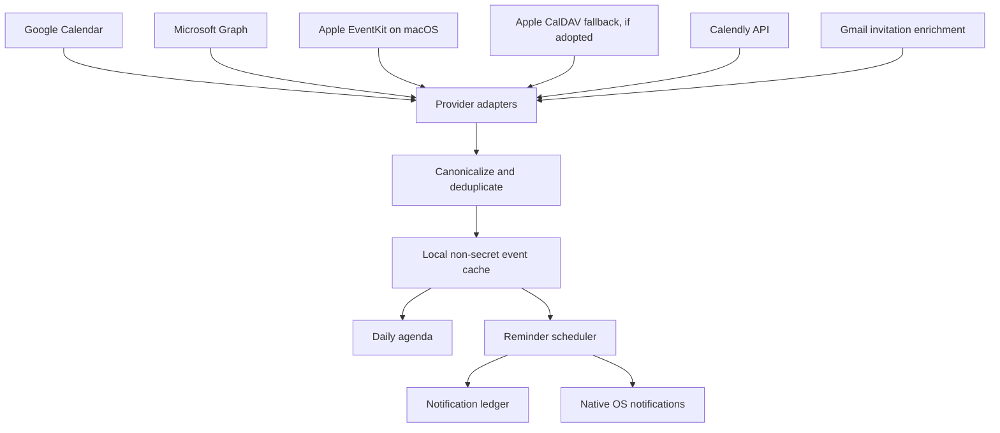

# Calendar Notifications and Reminders

## Goal

Calendar notifications and reminders are a primary Happy Wakey goal. The product should do more than show events. It should help the user tackle the day through a reliable agenda, timely preparation, one-click meeting access, and reminders that remain useful after sleep/wake and application restarts.

The target provider set is:

- Google Calendar;
- Microsoft 365/Outlook Calendar;
- Apple calendars;
- Calendly;
- Gmail calendar invitations that are not yet represented clearly in Calendar.

## Product Experience

### Morning Briefing

At a user-selected time, Happy Wakey should produce one daily briefing:

- first event and start time;
- meeting count and total meeting duration;
- free focus windows;
- conflicts and back-to-back blocks;
- invitations awaiting response;
- earliest preparation or departure time;
- important all-day events;
- weather at the location of the first in-person event when available.

The briefing should be visible on Home and optionally delivered as a desktop notification. It should be recomputed when the calendar materially changes.

### Event Reminders

Default reminder policy should be configurable. A sensible starting point is:

- morning briefing at the user's wake/work-start time;
- 30 minutes before meetings;
- 10 minutes before meetings;
- optional leave-by reminder for physical locations;
- optional end-of-day preview for tomorrow.

Notification actions:

- **Join**: open a validated video-meeting URL;
- **Open**: open event detail in Happy Wakey;
- **Snooze**: 5, 10, or 15 minutes;
- **Dismiss**: dismiss this reminder occurrence;
- **Respond**: accept/tentative/decline when the provider and permission allow it.

Quiet hours, all-day-event behavior, canceled events, declined events, and focus blocks require explicit settings.

## Canonical Event Model

Every provider adapter should normalize into one Rust structure before QML or the reminder scheduler sees it.

```rust
struct CanonicalEvent {
    canonical_id: String,
    provider: CalendarProvider,
    provider_account_id: String,
    provider_event_id: String,
    ical_uid: Option<String>,
    recurrence_instance: Option<String>,
    title: String,
    start: DateTime<FixedOffset>,
    end: DateTime<FixedOffset>,
    all_day: bool,
    status: EventStatus,
    response_status: ResponseStatus,
    organizer: Option<Person>,
    attendees: Vec<Person>,
    location: Option<String>,
    join_url: Option<Url>,
    description: Option<String>,
    provider_updated_at: Option<DateTime<Utc>>,
    etag: Option<String>,
}
```

The canonical model must preserve provider IDs for updates while using `iCalUID`, recurrence instance, organizer, and start time to deduplicate cross-provider copies.

Example: a Calendly booking can also appear in Google Calendar and as a Gmail invitation. Happy Wakey should show and notify one meeting, not three records.

## Sync Architecture



Provider sync runs on Rust worker threads. Results return to a single event coordinator, which normalizes, deduplicates, updates the local cache, reconciles scheduled reminders, and publishes a typed/summarized model to QML.

## Current Implementation

The July 2026 implementation establishes the first local reminder slice:

- Google Calendar and Microsoft Graph responses normalize into one `CalendarEvent` shape with provider IDs, `iCalUID`, status, all-day semantics, local day/time labels, location, and validated join/event URLs;
- duplicate occurrences are collapsed by provider, `iCalUID`, and start time;
- Home and Calendar receive a separate daily agenda summary with remaining-event, duration, conflict, and next-event fields;
- a Rust worker reconciles reminders every 20 seconds using user-selected 30, 10, and 5 minute offsets;
- all-day, canceled, and already-started events do not notify;
- late refresh sends one useful alert instead of a burst, while recording all elapsed offsets;
- delivery IDs are retained for 31 days in an atomic `0600` ledger and are restored for retry if native delivery fails;
- a Settings action exercises the native notification path directly.

The current scheduler is process-based: the app must be running, and its calendar data must have refreshed. It does not yet persist an offline event cache, snooze notifications, refresh provider tokens, consume incremental sync tokens, or aggregate multiple provider accounts at once. macOS delivery was verified from a registered app bundle; Windows and Linux still require installed-package acceptance tests.

## Provider Strategy

### Google Calendar

Use installed-application OAuth for normal users. Request the minimum calendar scopes necessary for the chosen feature set. Read-only scope is enough for agenda/reminders; responding to invitations or editing events requires broader permission and separate user consent.

Initial serverless sync:

- list calendars;
- run an initial event sync;
- retain Google's incremental `syncToken` per calendar;
- poll while the app is running and after wake/resume;
- fall back to a full sync when a token expires.

Google Calendar push channels require a public HTTPS webhook. They cannot call a listener that exists only on the user's laptop. Push should therefore be a later optional relay feature, not a requirement for the first reminder release.

### Microsoft 365 and Outlook

Use delegated user OAuth through Microsoft Graph. Normalize both personal Microsoft accounts and work/school accounts where the tenant permits access.

Initial serverless sync should use Calendar View plus Graph delta queries where supported. Microsoft change notifications require a public notification endpoint (or Event Hubs/Event Grid), so near-real-time webhook delivery also implies a relay service.

### Apple Calendars

Sign in with Apple does not grant calendar access.

On macOS, the best integration is an EventKit adapter implemented through a small Objective-C++/Rust bridge. EventKit accesses calendars already configured in the Mac Calendar app, including iCloud and other accounts. The app must request user permission and include the macOS calendar entitlement when sandboxed.

For Windows and Linux, choices are less uniform:

1. Add an iCloud CalDAV adapter using an Apple app-specific password stored in the OS credential vault.
2. Ask users to connect the same underlying Google/Microsoft account directly when their Apple Calendar is only a client for that account.
3. Initially document Apple calendar read support as macOS-only and expand after the Google/Microsoft reminder engine is stable.

Option 3 is the lowest-risk first release. A CalDAV implementation adds credential, recurrence, sync-token, and interoperability complexity.

### Calendly

Calendly API v2 supports personal access tokens for internal integrations and OAuth for public multi-user applications. Happy Wakey should use a native OAuth application with PKCE for real users. Personal access tokens should remain a developer-only option.

Serverless first release:

- authenticate with native OAuth/PKCE;
- poll scheduled events and cancellations while the app is active;
- deduplicate against calendar events using invitee, organizer, time, and iCalendar metadata;
- refresh on resume and before computing the daily agenda.

Calendly webhooks are useful for schedule/cancel/reschedule events but need a publicly reachable receiver. Webhook availability also depends on the Calendly account plan. A webhook relay can be added later.

### Gmail Invitations

Google Calendar should remain the primary source. Most accepted/tentative invitations become calendar events and do not need Gmail parsing.

Gmail integration is optional enrichment for:

- invitations awaiting response that are not yet visible in the event list;
- updated or canceled `.ics` invitations;
- meeting links/details present only in the message;
- invitations routed to an alternate mailbox.

For a desktop-first implementation, use incremental Gmail polling with the authenticated user's OAuth token. Google's current guidance recommends poll-based synchronization for user-owned installed devices. Parse structured MIME and `text/calendar`/ICS parts, not arbitrary rendered email HTML.

Gmail push uses `users.watch` and Google Cloud Pub/Sub. A watch must be renewed at least every seven days, and notifications only signal mailbox history changes; the client still fetches details. A public webhook or managed pull architecture adds infrastructure and secret-management requirements. It is not necessary for the first local reminder version.

Public use of Gmail scopes can trigger Google's app verification and data-handling review. Request the narrowest scope and keep Gmail optional.

## Do We Need a GCP Service Account?

Not for the normal consumer desktop flow.

Use user OAuth for a person's Google Calendar and Gmail. A service account normally represents an application, not a personal Google user. It can access Workspace user data only when a Workspace super administrator grants domain-wide delegation and the application deliberately impersonates users.

A service account is appropriate for:

- an enterprise Happy Wakey deployment managed by one Google Workspace domain;
- a Cloud Run/Function relay consuming Pub/Sub or renewing watches;
- other backend-owned Google Cloud resources.

Rules:

- never include a service-account JSON key in the desktop app;
- never write it into Happy Wakey config or Git backup;
- on Google Cloud, use the runtime's attached service identity/workload credentials;
- use domain-wide delegation only with explicit administrator authorization and least-privilege scopes.

## Serverless Versus Small Relay

### Phase 1: No Custom Server

The app can deliver useful reminders without a server:

- user OAuth in the system browser;
- incremental polling while running;
- refresh on startup and wake/resume;
- local canonical cache;
- locally scheduled native notifications;
- Supabase only for auth/onboarding/config sync.

This is the recommended first milestone.

### Phase 2: Optional Event Relay

Use a small relay only when near-real-time changes while the desktop is offline become important. It can receive:

- Google Calendar watch notifications;
- Microsoft Graph change notifications;
- Gmail Pub/Sub notifications;
- Calendly webhooks.

The relay should store only routing/subscription metadata and encrypted refresh credentials when unavoidable. It can publish a minimal "account changed" signal to the desktop, which then fetches authoritative data from the provider.

Possible implementation choices:

- Supabase Edge Functions plus a minimal subscription table;
- Google Cloud Run for Google Pub/Sub alignment;
- another serverless HTTPS function with a durable job/renewal scheduler.

A relay does not require replacing JSON config with a central application database. It does require a small durable store for webhook channels, expiration/renewal, user routing, and replay protection.

## Reminder Scheduler

The completed local slice persists the notification ledger outside the user config. The next persistence step is a bounded event cache for offline agenda display:

1. bounded event cache: planned;
2. notification ledger for deduplication: implemented;
3. snooze state: planned.

Suggested reminder ID:

```text
hash(canonical_event_id | occurrence_start | reminder_offset | policy_version)
```

On every sync:

1. normalize and deduplicate events;
2. diff against the previous cache;
3. cancel reminders for deleted, declined, or moved events;
4. schedule new/changed reminders within the horizon;
5. retain ledger entries long enough to prevent duplicate delivery;
6. recompute the morning briefing when the day changes materially.

The scheduler must handle:

- recurring events and exceptions;
- DST/timezone changes;
- system sleep and wake;
- clock changes;
- offline startup;
- canceled/rescheduled meetings;
- all-day events;
- multiple provider accounts;
- duplicate events across Calendly, Gmail, and calendars.

## Native Notifications

Reliable cross-platform reminders need platform adapters:

| Platform | Recommended mechanism | Notes |
| --- | --- | --- |
| macOS | UserNotifications framework | Request permission; scheduled notifications can survive app suspension |
| Windows | Windows toast notifications | Requires stable application identity/installer metadata for full behavior |
| Linux | Freedesktop notifications over DBus | Scheduling is not standardized; app/tray/background process generally remains active |

Qt's system tray can provide a common running-app surface, but it is not enough for dependable scheduled delivery on every OS. The Rust core should own reminder decisions while small native adapters own permissions, scheduling, actions, and activation callbacks.

## Implementation Milestones

### Milestone 1: Local Reminder Core

Implemented: normalized Google/Microsoft event parsing, a daily agenda summary, configurable offsets, native notification delivery, a persistent deduplication ledger, late-refresh reconciliation, and focused timezone/all-day/deduplication tests.

Remaining: provider incremental sync, durable event cache, morning briefing notification, snooze/actions, explicit sleep/wake hooks, and broader recurrence/reschedule fixtures.

### Milestone 2: Provider Breadth

- Apple EventKit adapter on macOS;
- Calendly native OAuth and polling;
- optional Gmail invitation polling/ICS parsing;
- cross-source deduplication;
- invitation response controls where authorized.

### Milestone 3: Windows and Linux Notifications

- Windows toast adapter and activation routing;
- Linux DBus adapter and background/tray lifecycle;
- installed-package acceptance tests.

### Milestone 4: Optional Push Relay

- provider webhook/Pub/Sub receivers;
- channel/subscription renewal jobs;
- signature/state validation and replay protection;
- minimal user routing;
- offline change signal and reconnect sync;
- clear privacy and deletion controls.

## Official Provider References

- [Google OAuth for installed applications](https://developers.google.com/identity/protocols/oauth2)
- [Google service accounts and domain-wide delegation](https://developers.google.com/identity/protocols/oauth2/service-account)
- [Google Calendar push notifications](https://developers.google.com/workspace/calendar/api/guides/push)
- [Gmail push notifications and installed-client polling guidance](https://developers.google.com/workspace/gmail/api/guides/push)
- [Microsoft Graph change notifications](https://learn.microsoft.com/en-us/graph/change-notifications-overview)
- [Calendly API authentication](https://developer.calendly.com/getting-started)
- [Calendly native OAuth/PKCE app setup](https://developer.calendly.com/create-a-developer-account)
- [Apple EventKit calendar access](https://developer.apple.com/documentation/eventkit/accessing-the-event-store)
